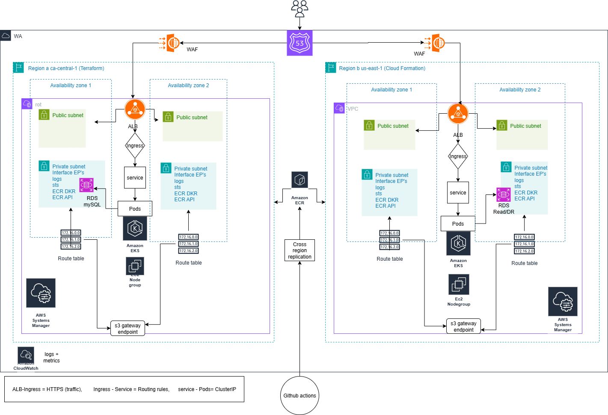

AWS Capstone – EKS Multiregion Deployment 

📌 Overview

This project demonstrates a multi-region AWS deployment of a containerized microservice using:

Terraform (Region A: ca-central-1)

CloudFormation (Region B: us-east-1)

Amazon EKS (managed Kubernetes on EC2 nodegroups)

Amazon RDS MySQL (primary in Region A, read/DR replica in Region B)

Amazon Route 53 for DNS failover

Amazon ECR with cross-region replication

VPC Endpoints (S3, ECR API/DKR, Logs, STS) instead of costly NAT Gateways

This design supports high availability, cost optimization, and private communication inside AWS.

🏗️ Architecture Diagram

The system is deployed across two AWS regions with Route 53 failover and GitHub Actions CI/CD.

📂 Repository Structure

aws-capstone-eks-multiregion/
├── terraform/
│ ├── modules/
│ │ ├── vpc/ # VPC, subnets, route tables, VPC endpoints
│ │ ├── eks/ # EKS cluster + managed nodegroups
│ │ └── rds/ # RDS MySQL (private subnets)
│ ├── region-a-ca-central-1/
│ │ ├── provider.tf
│ │ ├── main.tf
│ │ ├── variables.tf
│ │ └── outputs.tf
│ └── region-b-us-east-1/
│ └── ... (CloudFormation templates)
├── k8s/
│ └── cart/ # Kubernetes manifests for Cart microservice
├── .github/workflows/ # CI/CD pipelines (GitHub Actions)
└── docs/
└── architecture.png

⚙️ Terraform Modules
🔹 VPC Module

Creates VPC, public & private subnets across 2 AZs

Attaches route tables

No NAT gateway — instead uses VPC Endpoints:

Gateway: S3

Interface: ECR (API & DKR), CloudWatch Logs, STS

🔹 EKS Module

Creates EKS cluster (1.29)

Managed nodegroups (EC2 workers) in private subnets

IAM roles & policies for cluster + nodes

🔹 RDS Module

Creates RDS MySQL in private subnets

Secured by SG (restricted to EKS SG — configurable)

Easily extendable for Read Replicas / DR in Region B

🔄 Deployment Flow

Region A (Terraform)

Run Terraform to provision VPC, EKS, RDS in ca-central-1.

Update kubeconfig & verify cluster.

cd terraform/region-a-ca-central-1
terraform init
terraform apply
aws eks update-kubeconfig --name capstone-eks-ca --region ca-central-1
kubectl get nodes

CI/CD (GitHub Actions)

Builds & pushes Docker images to ECR

Cross-region replication keeps images synced to Region B

Region B (CloudFormation)

Deploys failover EKS + RDS (read/DR) in us-east-1

Route 53 switches traffic here on health check failure

📦 Microservice (Cart Service Example)

Language: Java (Spring Boot, Maven)

Deployment: Helm/K8s manifests in k8s/cart/

Database: Uses RDS MySQL via Kubernetes Secrets

✅ Key Features

Multi-region HA architecture

Cost-optimized with VPC Endpoints (no NAT)

Modular Terraform code (VPC, EKS, RDS)

CI/CD pipeline with GitHub Actions + ECR replication

Kubernetes Ingress + ALB Controller integration

Route 53 DNS failover across regions

🚀 Next Steps

Add AWS Load Balancer Controller (via Helm + IRSA)

Configure RDS Read Replica in Region B

Deploy Cart microservice and test failover